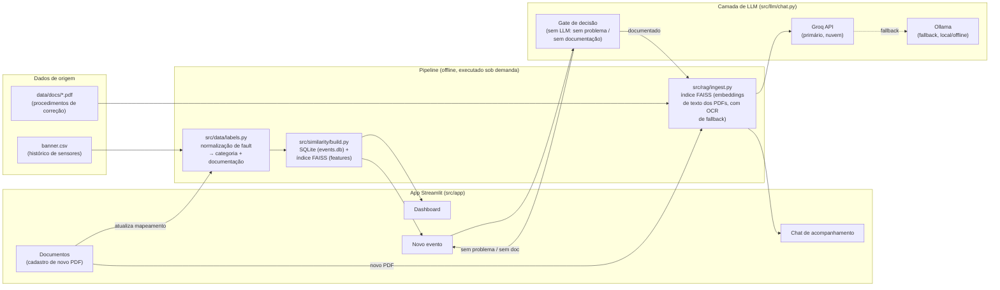
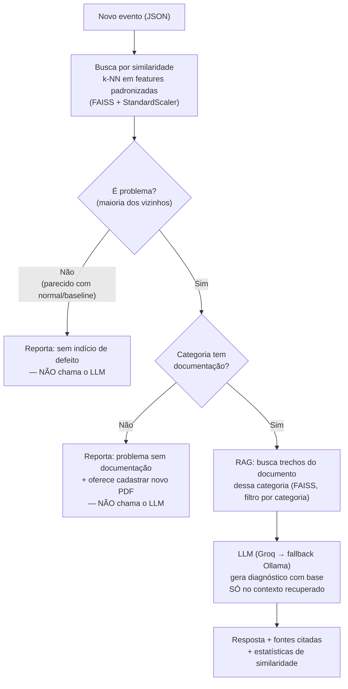
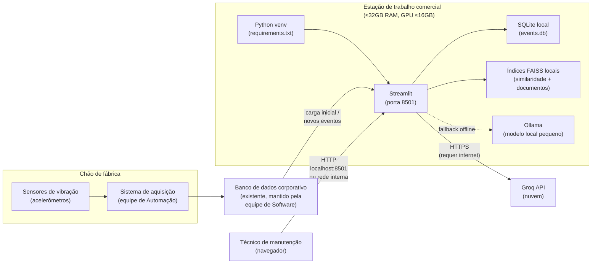

# Arquitetura da Solução

Este documento descreve a arquitetura da solução de Manutenção Prescritiva e a
proposta de implantação em ambiente industrial, conforme pedido no item 3 do
edital ("Arquitetura da Solução" e "Definição de arquitetura técnica para
implantação do projeto em ambiente industrial").

## 1. Visão geral dos componentes

**Por que essa separação:** cada seta representa uma fronteira testável de forma
isolada (ver `tests/`). O ponto mais importante da arquitetura é o **Gate**: ele
decide se o LLM é chamado *antes* de qualquer prompt existir, então "problema sem
documentação" nunca depende do LLM se comportar bem — ele simplesmente não é
acionado nesse caminho.

## 2. Fluxo de decisão de um novo evento

Note que o campo `fault` do JSON de entrada **não é usado** nessa decisão — a
identificação da categoria vem inteiramente da similaridade de features
numéricas, conforme pedido no edital ("não depende necessariamente da
classificação prévia de falhas conhecidas").

## 3. Componentes técnicos

| Módulo | Responsabilidade | Por quê |
|---|---|---|
| `src/data/labels.py` | Normaliza os 151 rótulos brutos de `fault` em 9 categorias de defeito + estado operacional; resolve qual documento cobre cada categoria (estático + registros dinâmicos) | Os rótulos brutos têm variações de posição/carga/repetição e erros de digitação — sem essa normalização, a busca por similaridade e a checagem de documentação não fariam sentido |
| `src/similarity/` | `build.py` materializa o histórico em SQLite + índice FAISS; `search.py` faz a busca k-NN e agrega estatísticas (quantidade, frequência, contexto operacional) | Separar "montar o índice" de "consultar o índice" permite reconstruir o índice (ex.: depois de cadastrar um documento novo) sem reescrever a lógica de busca |
| `src/rag/ingest.py` | Extrai texto dos PDFs (com fallback de OCR local), gera chunks com metadado de categoria/documento, embeddings multilíngues, índice FAISS | Ver `notas-internas/DECISIONS.md` para o caso de um PDF sem texto extraível (Doc1) e o ajuste de `fetch_k` para não perder trechos relevantes |
| `src/llm/chat.py` | Orquestra similaridade → gate → RAG → LLM; expõe `analyze_event()` (novo evento) e `ask_about_category()` (chat de acompanhamento) | É aqui que a trava anti-alucinação vive — ver seção 1 |
| `src/app/streamlit_app.py` | Interface única: Dashboard, Novo evento (+chat), Documentos | Prioriza entrega dentro do prazo (ver liberdade de ferramentas, item 4 do edital); API/banco de dados dedicado ficam como possível evolução (diferencial do edital) |

## 4. Arquitetura de implantação em ambiente industrial

### Decisões de dimensionamento

- **Footprint local é intencionalmente leve**: os embeddings (FastEmbed) e a busca
  vetorial (FAISS `IndexFlatL2`) rodam em CPU, sem exigir a GPU da estação — a
  GPU listada na restrição do edital fica como folga, não como requisito. Índices
  atuais: ~166 mil vetores de 17 dimensões (similaridade) e ~80 chunks de texto
  (documentos) — ambos triviais para 32GB de RAM.
- **Groq como LLM primário** desloca o único passo computacionalmente pesado
  (geração de texto) para a nuvem. Trade-off: exige internet na estação. Mitigado
  pelo fallback `ChatOllama` (`with_fallbacks` do LangChain) — um modelo pequeno
  local garante resposta mesmo se a internet cair, ao custo de qualidade menor.
- **SQLite em vez de um servidor de banco dedicado**: zero infraestrutura extra
  na estação, arquivo único fácil de fazer backup/versionar operacionalmente.
  Trocar por PostgreSQL é direto (mesma interface pandas `to_sql`/`read_sql`) se o
  volume de eventos crescer a ponto de justificar um servidor dedicado — listado
  como possível evolução, já que Bancos de Dados é um diferencial citado no
  edital.
- **Sem contêiner por padrão**: a aplicação roda com `python -m streamlit run`
  direto na estação, minimizando dependências de infraestrutura. Uma imagem
  Docker (Python + requirements.txt + `ENTRYPOINT streamlit run`) é a evolução
  natural para padronizar o ambiente entre estações — também listada como
  diferencial no edital, não implementada agora por prioridade de prazo.

### Segurança e segredos

- `GROQ_API_KEY` fica em `.env`, nunca versionado (`.gitignore`), carregado via
  `python-dotenv`.
- Nenhum dado sai da rede da empresa além do necessário para a chamada ao Groq
  (o prompt inclui o trecho do procedimento recuperado + os dados do evento —
  vale considerar se isso é aceitável para a política de dados da empresa antes
  de operar em produção; o fallback Ollama existe justamente para o cenário em
  que enviar dados a um provedor externo não é uma opção).

## 5. Limitações conhecidas

- Acurácia da busca por similaridade (k-NN em features padronizadas) medida em
  73,3% agregada, com queda significativa em baixa rotação (500 RPM), onde o
  sinal de falha incipiente se aproxima do ruído de base. Ver
  `notas-internas/DECISIONS.md` para a análise completa e ideias de melhoria
  (features específicas de frequência de defeito — BPFO/BPFI/BSF/FTF).
- `retrieve_for_category` busca o índice de documentos inteiro como pool de
  candidatos antes de filtrar por categoria — funciona bem para o volume atual
  (dezenas a centenas de chunks); se o acervo de documentos crescer para milhares
  de páginas, essa estratégia precisa ser revisitada (ex.: um índice FAISS por
  categoria, em vez de um único índice global filtrado).
